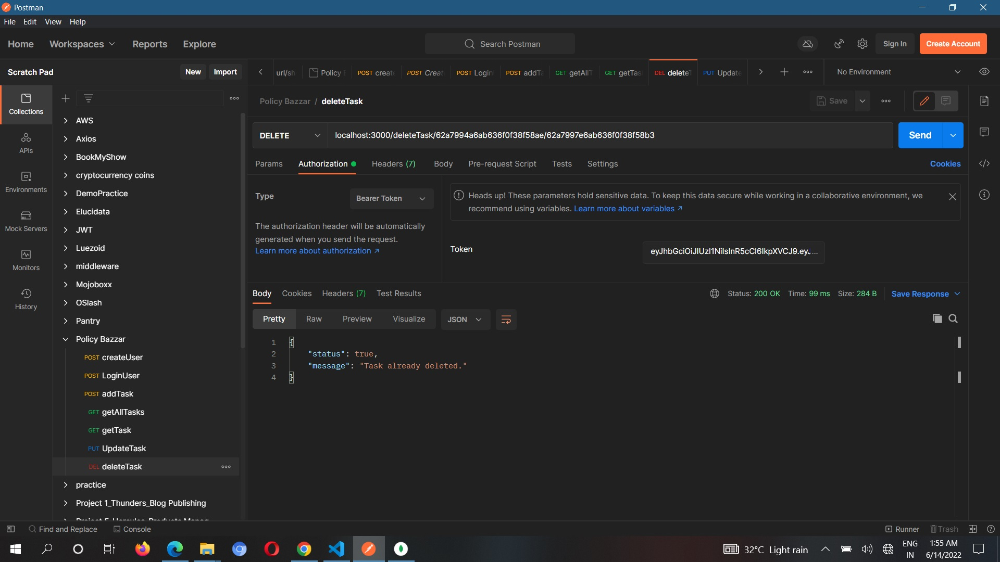

# Policy Bazaar-assignment


### Models
- User Model
```yaml
name: {
        type: String,
        required: true
    },
    email: {
        type: String,
        required: true,
        unique: true
    },
    password: {
        type: String,
        required: true
    },
    phone: {
        type: String,
        required: true

    }
```

- Todo Model
```yaml
    list: {
        type: String,
        required: true
    },
    task: {
        type: String,
        required: true,
        unique: true
    },
    date: {
        type: String,
        required: true
    },
    time: {
        type: String,
        required: true

    },
    status: {
        type: String,
        default: 'To-do',
        enum: ['To-do','In progress', 'Completed']
    },
    isDeleted: {
        type: Boolean,
        default: false
    }
```
  ### Postman samples
 
 

 

 
 
 

 
 
 

 
 
  
  ## Run Command - npm start
  
  ### 
  

